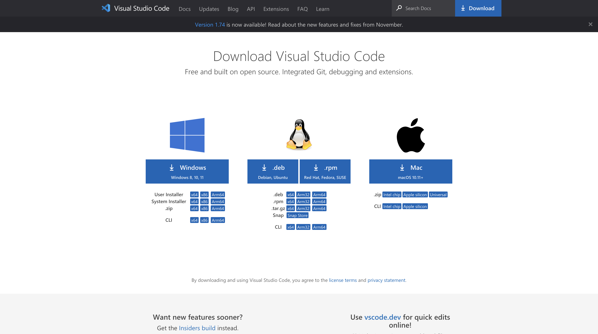
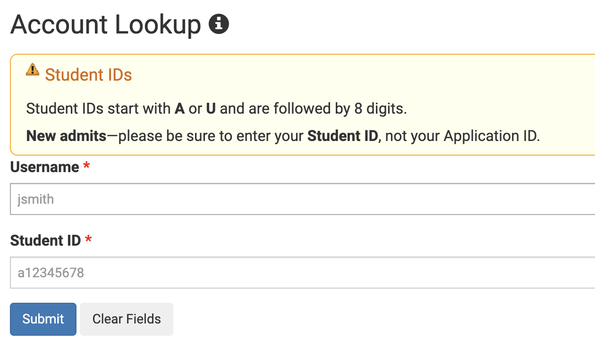
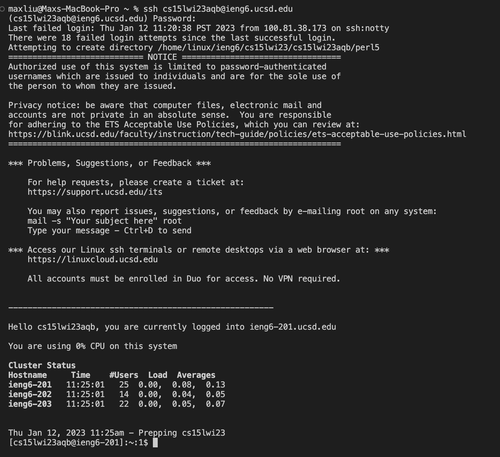
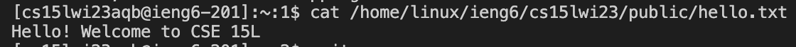

# Tutorial to log into a course-specific account on ieng6

# Installing VSCode

The first step to take is to install VSCode, this can be done by visiting the [VSCode](https://code.visualstudio.com/download) website and installing the application based on your operating system. I did not follow this step exactly as I already had VSCode installed on my computer after taking CSE 11, so this might be true for you too. A screenshot is attached below regarding what this website looks like. 

# Remotely connecting

**Setting up your course specific account**

The next step can be a bit tricky and involves remotely connecting to a computer in the CSE basement. Firstly, install git for your computer. I did not follow this step exactly because I already had git installed on my computer. 

Next, find your course specific account [here](https://sdacs.ucsd.edu/~icc/index.php). It should look something like the following.

After locating your account, follow this [tutorial](https://docs.google.com/document/d/1hs7CyQeh-MdUfM9uv99i8tqfneos6Y8bDU0uhn1wqho/edit) in order to reset your password. This process can be difficult, so make sure to read the tutorial carefully. After changing the password, note that it may not update instantly, and you may need to wait 15 minutes to an hour before it updates. 

**Connecting to a remote computer**

Now that you have your account, you can try to access a remote computer. Open a terminal in vscode and type `ssh YOURACCOUNT@ieng6.ucsd.edu` Make sure to replace YOURACCOUNT with your course specific account. The terminal will then prompt you to confirm if you want to continue connecting so just type yes. Then, it will finally prompt you for your password. If you type the password correctly and it has been succesfully reset, you should see the following message. If it continues to prompt you for the password you either did not reset it properly or typed the wrong password. I suggest you try copy pasting your password just in case you typed it wrong since terminal does not let you see what you are typing. When succesful, it should look something like the screenshot below. 

# Trying some commands

Finally, lets practice running some commands, both on your computer and the remote computer. Use what you learned from lecture and how to navigate files to try and move around directories. Some commands you can try using are `cd`, `ls`, or `pwd`. Remember, that if the terminal does not say anything, then your command was likely succesful! On the other hand, if something went wrong or an error occurred, the terminal will print out the error. Below, I attached a screenshot of a succesful `cd` command in which I changed my current directory to "donwloads". Notice that it did not print anything so the command was succesful. It is also important to note after running this command, you now see "downloads" to the right of the % symbol. This is your current directory, which has now been switched to downloads after running the `cd` command! You can also try running commands on the remote computer such as `cat /home/linux/ieng6/cs15lwi23/public/hello.txt`. I attached a screenshot of this command as well as well as the output that it produces. 

