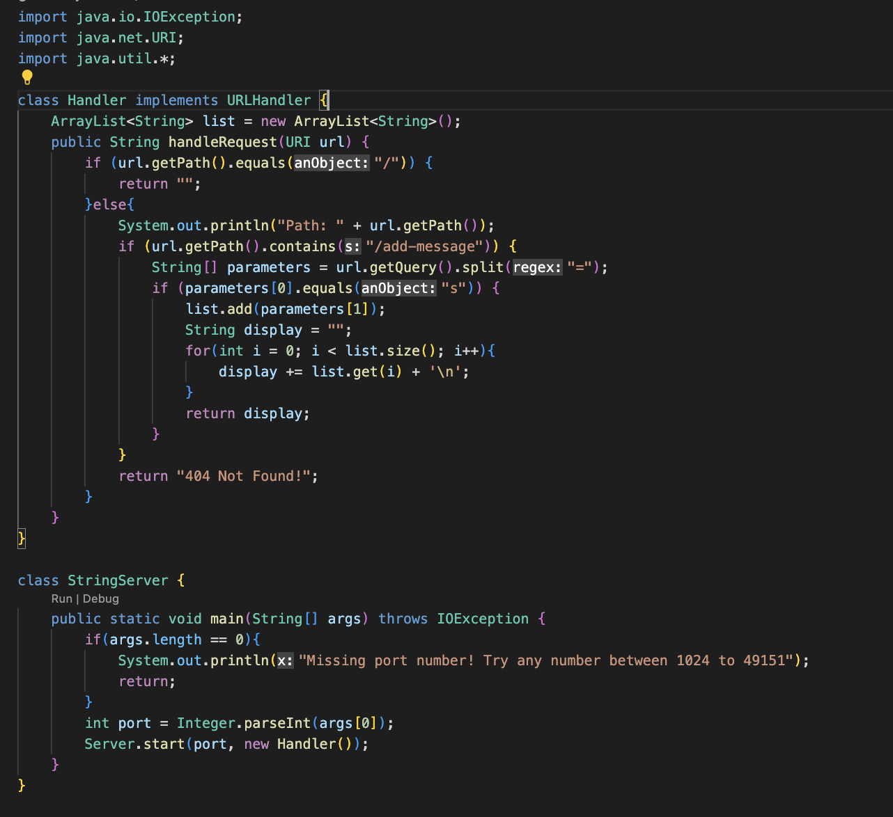
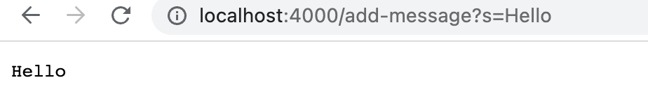
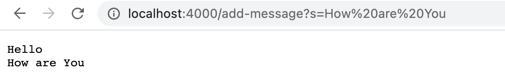
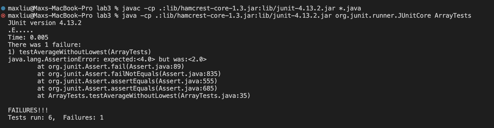

# Week 3 Lab Report

# Part 1
**Below is the code for my StringServer**


**Below are the screenshots of using `/add-message`**



In this first screenshot, firstly the main method is called when the program is run. Then, the `handleRequest` method is run. For the main method, the primary relevant argument is the input in the terminal, which communicates which port to start the web server on. In this case, it is 4000. For the `handleRequest method`, there are several important arguments and values. Firstly, there is the method parameter `URI url` which represents the url of the web server that is being run. Second, there is the `ArrayList<String> list`. This list represents a list of the strings that are being stored on the web server. Finally, there is also `String display`. This string represents what is going to be output to the web server. It represents all the strings in the arraylist list with line breaks between each element. From this specific request, the String arraylist list is changed because a new element is added to it, "hello". The String display is also changed to "hello \n" because list was changed. 



In this second screenshot, firstly the main method is called when the program is run. Then, the `handleRequest method` method is run. For the main method, the primary relevant argument is the input in the terminal, which communicates which port to start the web server on. In this case, it is 4000. For the `handleRequest` method, there are several important arguments and values. Firstly, there is the method parameter `URI url` which represents the url of the web server that is being run. Second, there is `ArrayList<String> list`. This list represents a list of the strings that are being stored on the web server. Finally, there is also `String display`. This string represents what is going to be output to the web server. It represents all the strings in the arraylist list with line breaks between each element. From this specific request, the String arraylist list is changed because a new element is added to it, "How are you". The String display is also changed to "hello \n How are you \n" because list was changed. 

# Part 2
Failure-inducing input for `averageWithoutLowest` :  
```
@Test
  public void testAverageWithoutLowest() {
    double[] input1 = {3, 1, 1, 1, 5 };
    assertEquals(4.0, ArrayExamples.averageWithoutLowest(input1), 0);
  }
 ```
Input that doesn't induce a failure for `averageWithoutLowest`
```
@Test
  public void testAverageWithoutLowesWorkst() {
    double[] input1 = {3, 1, 5 };
    assertEquals(4.0, ArrayExamples.averageWithoutLowest(input1), 0);
  }
 ```

Symptom as output of running tests: 


Bug (Before): 
```
static double averageWithoutLowest(double[] arr) {
    if(arr.length < 2) { return 0.0; }
    double lowest = arr[0];
    for(double num: arr) {
      if(num < lowest) { lowest = num; }
    }
    double sum = 0;
    for(double num: arr) {
        if(num != lowest) { 
            sum += num; 
        }
    }
    return sum / (arr.length-1);
  }
```

Bug (After):
```
static double averageWithoutLowest(double[] arr) {
    if(arr.length < 2) { return 0.0; }
    double lowest = arr[0];
    for(double num: arr) {
      if(num < lowest) { lowest = num; }
    }
    double sum = 0;
    int counter = 0;
    for(double num: arr) {
        if(num != lowest) { 
            sum += num; 
        }else{
            counter++;
        }
    }
    return sum / (arr.length - counter);
  }
```

# Part 3
From lab in week 2 and week 3, I learned a lot about web servers, something that I did not know before. I learned specifically how to run a web server from the terminal and how to then access that web server. Furthermore, I learned the basics of constructing a web server in VSCode from scratch. 

