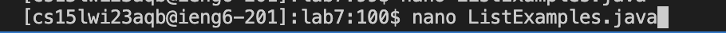

# Lab Report 4

In this lab report I will be uploading the commands I used for the challenge. 

# Step 1

In this step, I deleted the repository of my current fork by clicking "delete this repository". 

# Step 2

In this step, I forked the repository by clicking "create fork"

# Step 3

In this step, I started a timer by clicking start. 

# Step 4

In this step, I logged into ieng6 by typing `ssh cs15lwi23aqb@ieng6.ucsd.edu` and then hitting `<enter>`

# Step 5

In this step, I cloned the fork by first going to github and clicking code, then ssh, then the copy button. Then, back to terminal I typed `git clone` and then hit `<cmd v>` to paste the link. I then hit `<enter>`. 

# Step 6

First, I entered into the lab7 directory by typing `cd lab7` and hitting `<enter>`. I then listed the files in the directory by typing `ls` and then hitting `<enter>`. I then went to the course website, clicked weeks, then clicked week 3. I then scrolled down to the commands that I needed and highlighted the compile command and pressed `<cmd c>` to copy it. I then went to the terminal and pressed `<cmd v>` to paste it and then hit `<enter>`. I then went back to the course website and highlighted the run command and pressed `<cmd c>` to copy it. I then went to the terminal and pressed `<cmd v>` to paste it. I then pressed `<delete>` 10 times and then typed "TestListExamples". Finally, I hit `<enter>`. 

# Step 7

In this step, I first typed `nano ListExamples.java` to open the file. I then pressed `<down>` 42 times and then `<right>` 12 times. I then pressed `<delete>` once. Then, I pressed `<ctrl x>` and then hit `<y>` and then finally `<enter>`. This ultimately fixes the error, then saves and exits out of nano.

# Step 8

The `javac -cp .:lib/hamcrest-core-1.3.jar:lib/junit-4.13.2.jar *.java` command was 3 up in the search history, so I used up arrow 3 times to access it and then hit `<enter>`. Then the `java -cp .:lib/hamcrest-core-1.3.jar:lib/junit-4.13.2.jar org.junit.runner.JUnitCore TestListExamples` command was 3 up in the history, so I accessed and ran it in the same way.

# Step 9

I committed my changes by first typing `git add ListExamples.java` and then hit `<enter>` in order to stage my changes to be committed. I then committed this change by typing `git commit -m "Fixed ListExamples so it passes all tests"` and then hit `<enter>` in order to commit my change. Finally, I typed `git push` in order to push my changes and then hit `<enter>`. 
